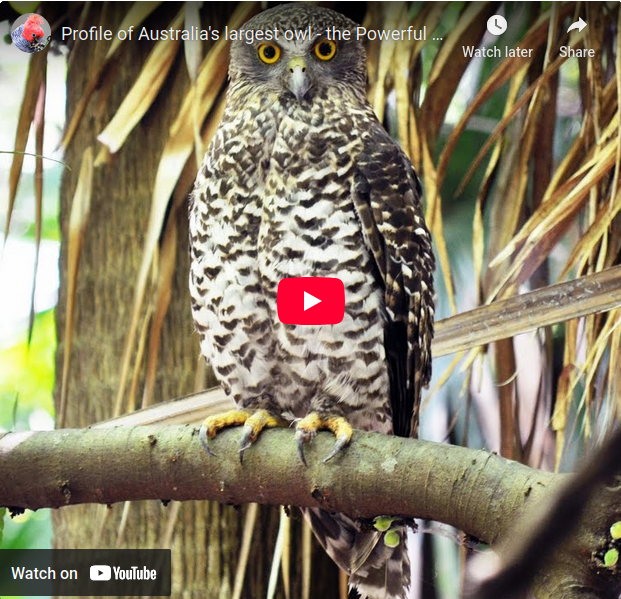

+++
title = "Home"
date = 2023-01-01T08:00:00-07:00
+++




{}

The Powerful Owl Project, run by BirdLife Australia, works with citizen scientists across South-East Queensland and Greater Sydney
to map, monitor and protect Australia’s largest owl in urban and peri-urban areas. We use acoustic recorders to capture owl calls
at night, helping us identify new territories and pinpoint nest trees and important roost sites for follow-up checks.
Computer analysis automatically detects owl calls and produces long-duration false-colour spectrograms, making it easy for us,
and for you, to spot owl activity and other species at a glance. By contributing recordings and observations, volunteers help us
build a clearer picture of where Powerful Owls live, the habitat they rely on, and how we can better reduce threats.

BirdLife Australia is partnering with the team at [Open Ecoacoustics](https://openecoacoustics.org/), who have many years of
experience working with passive acoustic data, to help process the vast amount of sound we collect and to automate species detections.
If you choose to verify calls, you’ll be asked to log in to the [Ecosounds](https://www.ecosounds.org/) platform so your verifications
can be recorded and tracked by BirdLife researchers as part of this ongoing project.

{}


<section class="two-column-section oe-image-column oe-image-left">
    

        <figure class="inline-video">
            <!--  -->
            
        </figure>
    

    

        

            <h2>Uncovering Hidden Soundscapes</h2>

            By confirming Powerful Owl calls, and identifying other birds and marsupials, you’re helping us uncover the hidden soundscape of Australia’s urban and bushland environments. This project is about more than just listening; it’s about discovering where wildlife lives, breeds, and thrives.

            Each confirmed call helps us locate owl territories we didn’t previously know about. These acoustic clues guide our volunteers and staff to investigate potential nest trees and monitor breeding success. Even in areas where we already know owls are present, acoustic recordings help us fine-tune our understanding by revealing the likely location of nest trees or important roost sites that might otherwise go unnoticed.

            Your contributions also support the development of computer models that automatically detect owl calls, making future monitoring faster and more efficient. And by testing how well acoustic recorders work across large areas, we’re exploring new ways to monitor threatened species at scale.

            Ultimately, the data you help verify informs conservation decisions, supports habitat protection, and strengthens our efforts to ensure Powerful Owls, and the species they live alongside, have a secure future.
        

    

</section>




<section class="two-column-section oe-image-column">
    

        <h2 id="what-youll-hear">What you'll hear</h2>

        Within these recordings, we can detect:

        <ul>
            <li>Male Powerful Owls — deep, resonant “whoo-hoo” calls.</li>
            <li>Females — slightly higher-pitched versions of the male call.</li>
            <li>Chicks — soft, insect-like trills, often described as high-pitched, raspy, and repetitive.</li>
            <li>Other species — the model also flags a host of interesting birds and marsupials.</li>
        </ul>

        By confirming these calls, you’re helping us locate key sites, verify breeding activity, and gather the data we need to protect Powerful Owls and the habitats they depend on.
    

    

        <sl-carousel pagination mouse-dragging loop>
            <sl-carousel-item>
                

                    <sl-card class="spectrogram-card">
                        

                            <h3 class="event-label">Powerful Owl (Male)</h3>
                            <oe-media-controls for="example-1"></oe-media-controls>
                        

                        

                            <oe-annotate>
                                <oe-axes>
                                    <oe-indicator>
                                        <oe-spectrogram
                                            id="example-1"
                                            src="Ninox-strenua-male.mp3"
                                            window-size="2048"
                                            window-overlap="512"
                                            mel-scale
                                        ></oe-spectrogram>
                                    </oe-indicator>
                                </oe-axes>
                                <oe-annotation
                                    start-time="0"
                                    end-time="3"
                                    low-frequency="200"
                                    high-frequency="1000"
                                ></oe-annotation>
                                <oe-annotation
                                    start-time="8.4"
                                    end-time="10.1"
                                    low-frequency="200"
                                    high-frequency="1100"
                                ></oe-annotation>
                            </oe-annotate>
                        

                    </sl-card>
                

            </sl-carousel-item>

            <sl-carousel-item>
                

                    <sl-card class="spectrogram-card">
                        

                            <h3 class="event-label">Powerful Owl (Female)</h3>
                            <oe-media-controls for="example-2"></oe-media-controls>
                        

                        

                            <oe-annotate>
                                <oe-axes>
                                    <oe-indicator>
                                        <oe-spectrogram
                                            id="example-2"
                                            src="Ninox-strenua-female.mp3"
                                            window-size="2048"
                                            window-overlap="1024"
                                            mel-scale
                                        ></oe-spectrogram>
                                    </oe-indicator>
                                </oe-axes>
                                <oe-annotation
                                    start-time="0.5"
                                    end-time="2.1"
                                    low-frequency="200"
                                    high-frequency="4300"
                                ></oe-annotation>
                                <oe-annotation
                                    start-time="9.3"
                                    end-time="10.9"
                                    low-frequency="250"
                                    high-frequency="4300"
                                ></oe-annotation>
                            </oe-annotate>
                        

                    </sl-card>
                

            </sl-carousel-item>

            <sl-carousel-item>
                

                    <sl-card class="spectrogram-card">
                        

                            <h3 class="event-label">Powerful Owl (Chick)</h3>
                            <oe-media-controls for="example-3"></oe-media-controls>
                        

                        

                            <oe-annotate>
                                <oe-axes>
                                    <oe-indicator>
                                        <oe-spectrogram
                                            id="example-3"
                                            src="Powerful-Owl_Ninox-strenua_chick-begging_Ed-McNabb.mp3"
                                            window-size="1024"
                                            window-overlap="128"
                                            window-function="tukey"
                                        ></oe-spectrogram>
                                    </oe-indicator>
                                </oe-axes>
                            </oe-annotate>
                        

                    </sl-card>
                

            </sl-carousel-item>

            <sl-carousel-item>
                

                    <sl-card class="spectrogram-card">
                        

                            <h3 class="event-label">Boobook Call</h3>
                            <oe-media-controls for="example-4"></oe-media-controls>
                        

                        

                            <oe-annotate>
                                <oe-axes>
                                    <oe-indicator>
                                        <oe-spectrogram
                                            id="example-4"
                                            src="Boobook call Fred van Gessel.m4a"
                                            window-size="4096"
                                            window-overlap="2048"
                                            window-function="flat-top"
                                            contrast="1.2"
                                            brightness="-0.1"
                                            mel-scale
                                        ></oe-spectrogram>
                                    </oe-indicator>
                                </oe-axes>
                            </oe-annotate>
                        

                    </sl-card>
                

            </sl-carousel-item>
        </sl-carousel>
    

</section>





<h2 id="meet-the-team">Meet the Team</h2>





### Mr Andrew Dinwoodie

Andrew is Birdlife Australia’s Powerful Owl Project Coordinator in South East Queensland.

Andrew is an ecologist with extensive experience in Natural Resource Management and threatened species recovery developed through many years working with the Queensland Parks and Wildlife Service Ecological Assessment Unit and the QPWS Threatened Species unit. His work with the Threatened Species Unit included key roles with the Northern Hairy-nosed Wombat and Bridled Nailtail Wallaby recovery projects.

Throughout his career Andrew has developed extensive expertise in species population management, integrated feral species management, natural resource and landscape management, fire ecology, and restoration ecology.



<--->



### Dr Holly Parsons

Manager of Priority Sites, BirdLife Australia

Holly is the Manager of Priority Sites at BirdLife Australia, where she oversees the Powerful Owl Project along with other key conservation initiatives. With a background in urban ecology and a strong focus on community engagement, Holly works closely with volunteers, researchers, and citizen scientists to protect critical habitats and a host of bird species, both threatened and common. Her leadership helps turn interest into actionable conservation outcomes across Australia’s urban and bushland landscapes.









<section class="progress-container text-block">
    
    

        <h2>Why it matters</h2>
        

            By helping identify bird calls, you're contributing to a growing
            library of acoustic data that:
        

        <ul>
            <li>Tracks how species respond to climate change</li>
            <li>Monitors ecosystem health after disasters</li>
            <li>
                Guides restoration efforts to ensure habitats don't just
                look right — they sound right, too
            </li>
        </ul>
    

</section>




